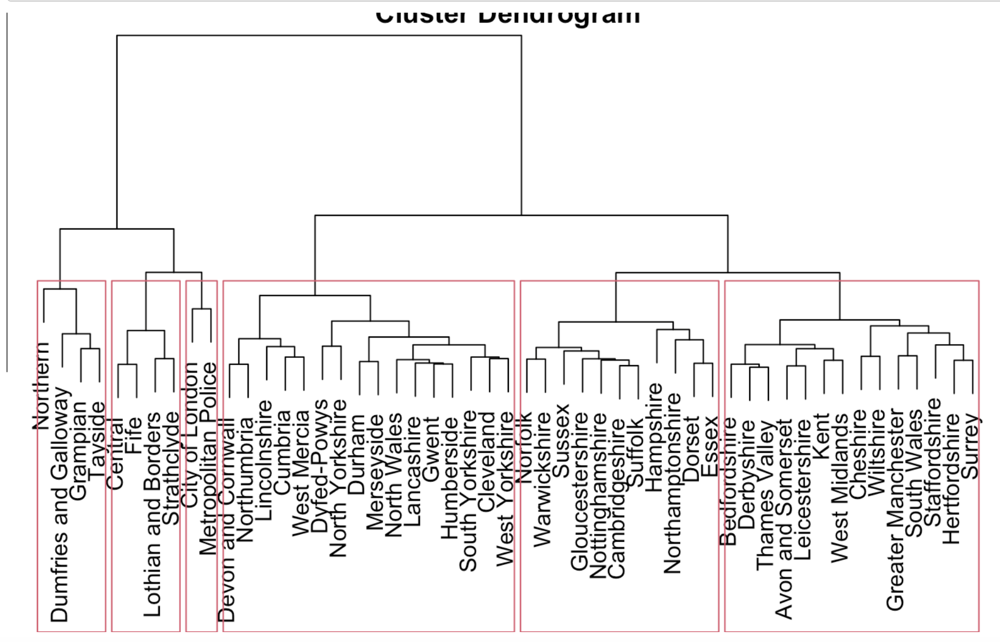

# Kaggle-Data-Analysis
## Supervised by [**___Dr. Wei Liu___**](https://research-repository.uwa.edu.au/en/persons/wei-liu)
## Topic One

### Introduction
My data comes from Kaggle. License is Public Domain.https://www.kaggle.com/mysarahmadbhat/120-years-of-olympic-history
The dataset is historical data from the modern Olympic Games, from Athens in 1896 to Rio de Janeiro in 2016. The data includes the athlete's name, gender, age, height, weight, country, and medal, as well as the project name, sport, game, year, and city, with a unique number for each athlete.
### Data Analysis
**[1] Number of Olympic Games**

**[2] Rank for Sport**

**[3] Sport Count**

**[4] Summer VS Winter**

**[5] Gender differences**

**[6] Multi-sport atheletes**

**[7] Retirement Age**

**[8] Countries**

## Topic Two

### Introduction
The data set analyzed can be obtained from the Kaggle platform. https://www.kaggle.com/silicon99/dft-accident-data

This dataset comes from the UK police forces who collect data on every vehicle collision in the UK from 2005 to 2015.In this project only one csv file named Accidents0515.csv which includes part of information is conisdered.

This project consists of four parts.After preparation,  part two is a warmup part, it will focus on the frequency of accidents during the year and the characteristics to start the anaysis. In the third part, it will select three factors to investigate in order to get what influence these factors have on the accident occurence and the accident severtity. Finally, a conclusion will be given

### Data Analysis
[1] CP

[2] Decision Tree

[3] Cluster

## Author
### Ame Liu

